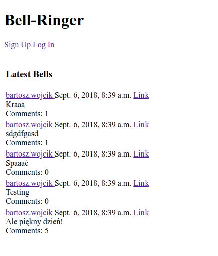
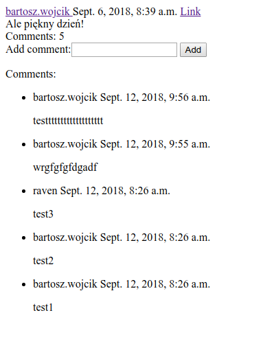
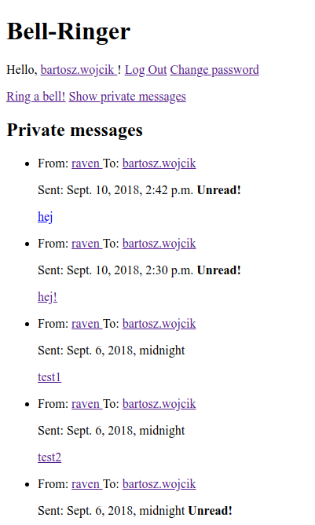
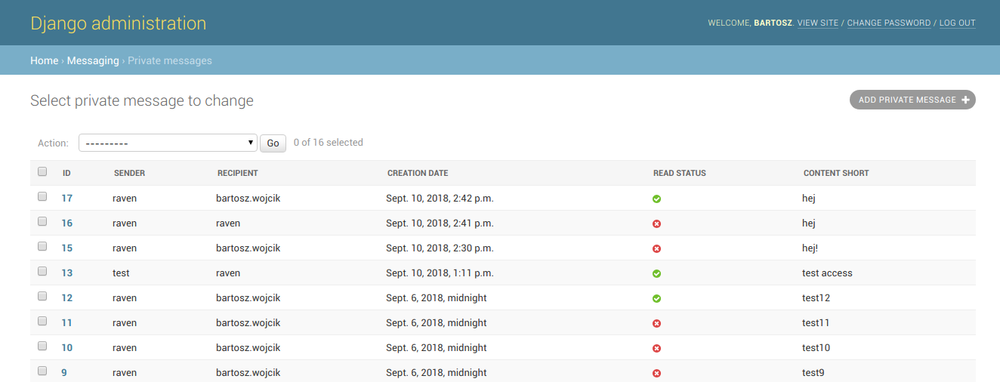

# 'Bell-Ringer', a Twitter-like messaging application
1-day bootcamp workshop, done using Python, Django, SQL. It is a web twitter-like application used for posting messages, commenting them and sending private messages between users.

# Main features
* Main site with all recent messages
* User registration and login
* Single message view
* Adding new messages
* Single user views
* Features accessed after authentication
* Permissions
* View with all private messages
* Message unread status, changing only when viewed as recipient
* Sending and reading private messages between users; without being able to send messages to yourself
* Every page requires login, except the main page, login and registration
* Admin page with registered tweets (posts), comments, private messages
* Adding comments and comment count
* Password change for logged-in user
* Optional, disabled by default, flag for posts, comments and messages marking them as blocked
* Custom template filters for blocked posts, comments and messages
* Admin actions for blocking visibility of posts, comments and messages
* Blocked posts are inaccessible through URL
* Account removal by users, setting default "Removed" for remaining posts and messages

Warning: Access to personal features is currently not restricted by protection against editing html.

# Sample screenshots

Message List (Index, Logged out)

Single Message with Comments

Private Messages

Message Administration (Django Admin)

# Author
Bartosz Wójcik
bartosz.wojcik@bartvessh.com
